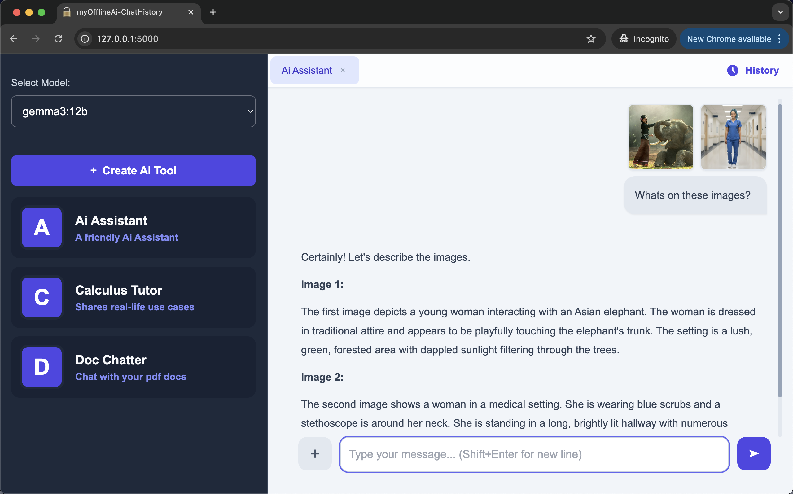
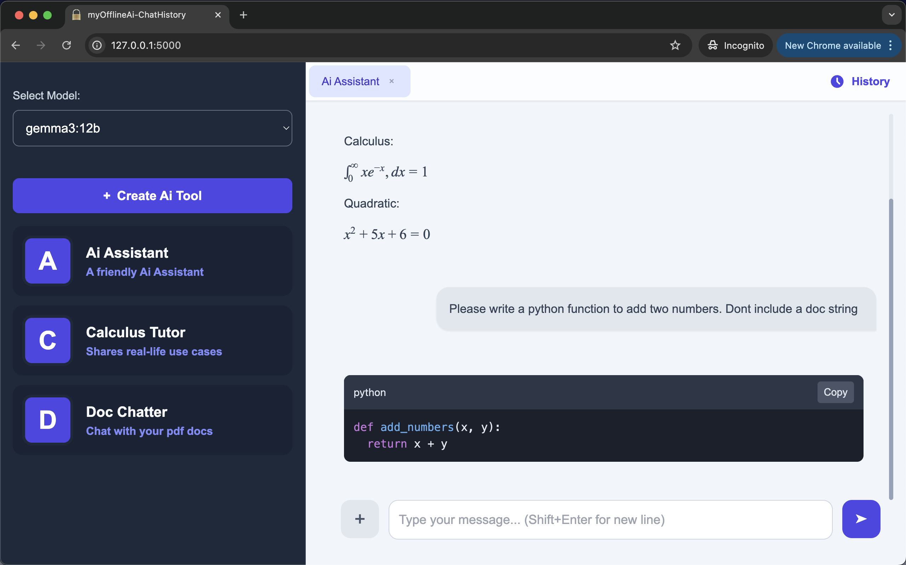

# myOfflineAi-ChatHistory
> 
> Prototype - For testing, education and inspiration

<br>

YouTube Video:<br>
MyOfflineAi - Privacy-First Local Ai for Non-programmers<br>
https://www.youtube.com/watch?v=m7NIjlvKLP8

<br>

A privacy-first Flask desktop UI for Ollama - with a chat history saving capability to support complex, long running professional tasks. Provides transparent, auditable and fully offline AI access for self-employed professionals, researchers, teachers and students who need data privacy. The app has a clean, intuitive interface with built-in support for math notation and code rendering.

- Ai access without an internet connection
- Runs on the desktop.
- Chat with Ollama models
- Create custom multimodal Ai tools - text, images, pdf (Specialized assistants - similar to Gemini Gems and OpenAi GPTs)
- Use the webcam photo feature to snap photos of hand drawn diagrams, hand written notes etc. The photo is auto attached to the chat.
- Chat histories are saved to a local, portable file
- Built to be simple and transparent. Single-file architecture - code is easy to audit because HTML, CSS, JS and Python are all in one file.
- Double-click a file to run. No need to use the command line after the initial setup.
- Suports images and pdf files
- Supports math notation and code rendering
- Free, open source, MIT License

This is a sister app of the myOfflineAi-PrivacyFirst version. Because that version processes all user data ephemerally, it does not have a chat history capability. myOfflineAi-ChatHistory has the same privacy-first, easy to audit design, but it also has the ability to store chat histories - a feature many privacy concious users still need. The chat histories are stored in a file named conversations.json. You can easily find it in the project folder. Deleting conversations.json will delete all chat history data from your computer. 

<br>


<p>myOfflineAi App - Supports images and pdf files</p>

<br>


<p>myOfflineAi App - Supports math notation and code rendering</p>


<br>


<p>Ollama Desktop App</p>

<br>


<p>Ollama Settings - Airplane mode</p>

<br>

## How to Install and Run

<br>

In this section you will do the following:
- Install the Ollama desktop app
- Download a small 250MB text-only Ollama model
- Install the UV Python package manager
- Start the myOfflineAi app by double clicking a file

Notes:<br>
- I tested the installation process on Mac OS. Although I've included instructions for Windows, I haven't tested on Windows.
- After setup, you only need to double-click a file to launch the app.

System Requirements:
- Recommended: 16GB RAM
- Minimum: Depends on the model size
- Enough free disk space to store the models you download

<br>

```

1. Download and install the Ollama desktop application
--------------------------------------------------------------

This is the link to download Ollama. After downloading, please install it on your computer.
Then launch it. A white chat window will open.
https://ollama.com/

Normally, Ollama will launch automatically when you start your computer.


2. Download an Ollama model
--------------------------------------------------------------

1. Open the Ollama desktop app.
2. Paste the model name (e.g. gemma3:270m) into the dropdown in the bottom right.
3. Type any message e.g. Hi, and press Enter
4. The model will start to auto download.

If you have a fast internet connection and at least 8GB RAM then I suggest you download
the gemma3:4b model (3.3GB).
This model can handle both text and images.
If you have a slow connection then download the smaller gemma3:270m model (292MB).
This model can handle text only.


3. Download the project folder and place it on your desktop
--------------------------------------------------------------

1. On GitHub click on "<> Code". The select "Download Zip"
2. Download the project folder and unzip it
3. Inside you will find a folder named: myOfflineAi-ChatHistory-v1.1
4. Place myOfflineAi-ChatHistory-v1.1 on your desktop.


4. Initial Setup
--------------------------------------------------------------

[ macOS ]

1. Open Terminal (Command+Space, type "Terminal")
2. Paste this command into the terminal to install uv:

wget -qO- https://astral.sh/uv/install.sh | sh

3. Wait for uv installation to finish
4. Type 'cd ' in the terminal (with a space after cd)
5. Drag the folder into the Terminal window. A file path will appear.
6. Press Enter
If you get an error, then type in these commands in the terminal to manually cd into myOfflineAi-ChatHistory-v1.1 folder:
cd Desktop
cd myOfflineAi-ChatHistory-v1.1

7. Paste this command into the terminal:

cat start-mac-app.command > temp && mv temp start-mac-app.command && chmod +x start-mac-app.command

8. Press Enter
9. Open the myOfflineAi-ChatHistory-v1.1 folder
10. Double-click: start-mac-app.command


[ Windows ]

1. Press the Windows key on your keyboard
2. Type cmd and press Enter (a black window will open)
3. Copy this entire command:

powershell -ExecutionPolicy ByPass -c "irm https://astral.sh/uv/install.ps1 | iex"

4. Right-click in the black window to paste
5. Press Enter
6. Wait for "uv installed successfully" or similar message
7. Close the window and open a new one for the changes to take effect
8. Navigate to the myOfflineAi-ChatHistory-v1.1 folder that's on your desktop
9. Double-click: start-windows-app.bat

If Windows shows a security warning:
1. Right-click on start-windows-app.bat 
2. Select "Properties"
3. Check the "Unblock" box at the bottom
4. Click "OK"
5. Now double-click start-windows-app.bat to run


5. Use the app
--------------------------------------------------------------

Click on "AI Assistant"
Type a message.

The name of the model you downloaded will appear in the dropdown menu in the top left.
If you downloaded the gemma3:4b model you can submit images and pdf documents in addition to text.

The app does not stop running when you close the browser tab.
To shut down the app simply close the terminal window.
You can also close the terminal by selecting it and typing Ctrl+C on Mac or Ctrl+C on Windows.


6. Future startup
--------------------------------------------------------------

Now that the setup is complete, in future simply Double-click a file to launch the app.
Place the project folder on your desktop before launching the app.

Mac:
start-mac-app.command

Windows:
start-windows-app.bat

You could start the app and leave it running in the background all day.
Then whenever you want to use it, enter the following url in your browser:

http://127.0.0.1:5000/

Your browser will remember this local address so you won't have to.


Quick Troubleshooting
--------------------------------------------------------------
- If the app doesn't start, make sure Ollama is running (look for its icon in your system tray/menu bar)
- If you see "connection refused", restart Ollama
- Make sure you've downloaded at least one model in Ollama before using the app

```

<br>

## App Family - Offline-First, Privacy-First, Transparent

- myOfflineAi-PrivacyFirst<br>(Maximum security. No chat history is saved.)<br>
  https://github.com/vbookshelf/myOfflineAi-PrivacyFirst<br>
- myOfflineAi-ChatHistory<br>(Saves chats to a local file you control.)<br>
  https://github.com/vbookshelf/myOfflineAi-ChatHistory<br>
- Chat-Image-Marker<br>(A simple, offline tool for marking up images.)<br>
  https://github.com/vbookshelf/Chat-Image-Marker<br>
- myOfflineAi-VoiceAssistant<br>(An offline full-featured Ai voice assistant.)<br>
  https://github.com/vbookshelf/myOfflineAi-VoiceAssistant


<br>

## Revision History

Version 1.1<br>
15-Oct-2025<br>
1- Added a webcam photo capability.<br>
The webcam can be used to quickly snap photos of homework problems, hand written notes, hand written math solutions, hand drawn diagrams etc.<br>
The photo is auto attached to the chat after being taken.<br>
2- Made other changes.

Version 1.0<br>
9-Oct-2025<br>
Prototype. Released for testing and education.


